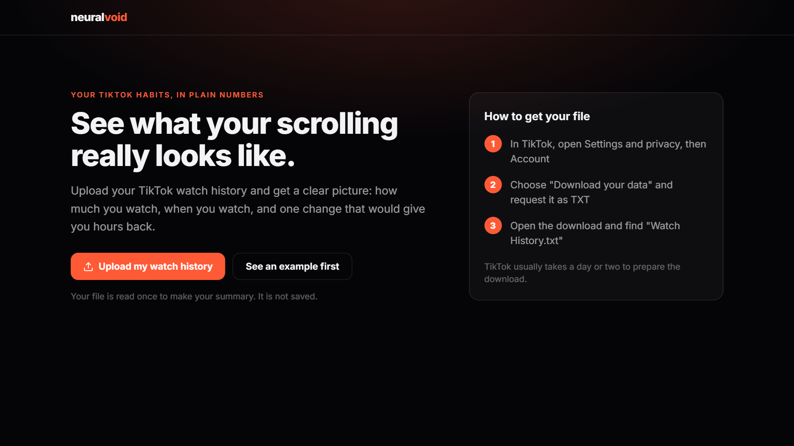
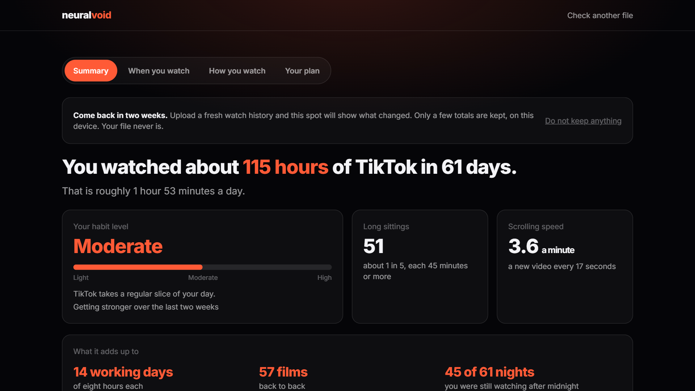
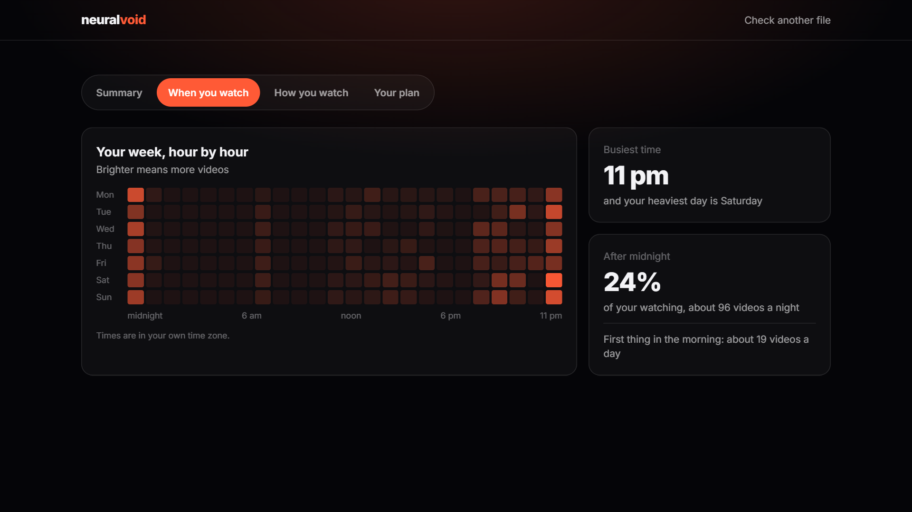
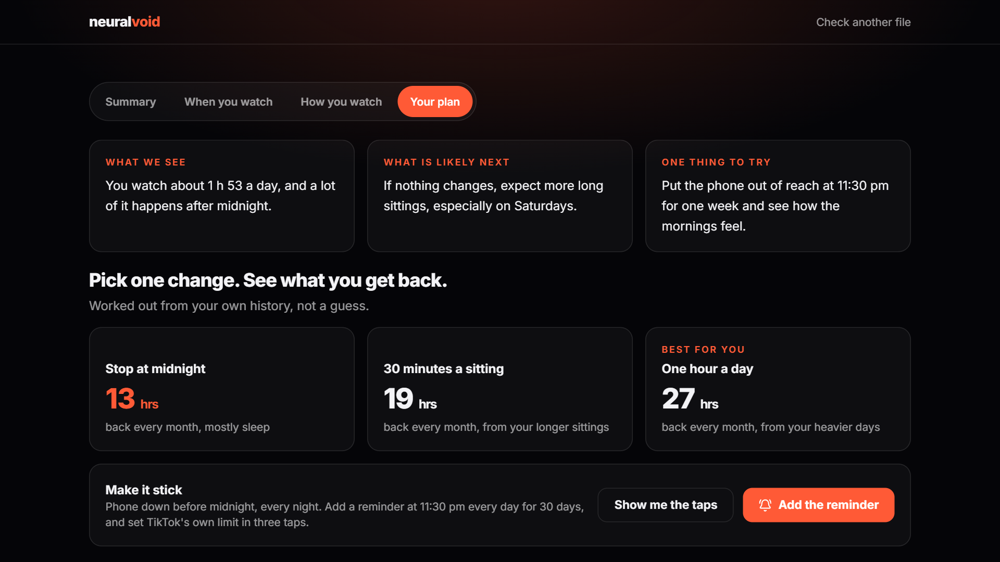

<div align="center">

# ⚡ Neural Void

**Your TikTok habits, in plain numbers**

[](https://www.python.org/)
[](https://fastapi.tiangolo.com/)
[](https://scikit-learn.org/)
[](https://xgboost.readthedocs.io/)
[](https://ai.google.dev/)
[](https://react.dev/)
[](https://vitejs.dev/)
[](https://tailwindcss.com/)

</div>

Upload your TikTok watch history and get a clear picture of your own habits: how much you watch, when you watch, and one change that would give you hours back. Under the hood it is a 25-feature machine-learning pipeline with a three-model ensemble; on the screen it is written for people who have never heard of either.

[Report a Bug](https://github.com/LouSens/neural-void/issues) · [Request Feature](https://github.com/LouSens/neural-void/issues)

---

## 📸 Screenshots

| Welcome | Summary |
|---|---|
|  |  |

| When you watch | Your plan |
|---|---|
|  |  |

Screens show a made-up watch history, not a real person's.

---

## ✨ Features

### What a person sees

| Screen | What it tells them |
|---|---|
| **Welcome** | What they get, and three steps for getting the file out of TikTok |
| **Add your file** | Confirms what it found ("about 24,800 videos · 61 days") before starting |
| **Reading your history** | Five plain steps while the analysis runs, instead of a spinner |
| **Summary** | "You watched about 115 hours of TikTok in 61 days", a habit level in words (Light, Moderate, High), what the hours add up to, and what stands out |
| **When you watch** | The week hour by hour, the busiest time, and how much happens after midnight |
| **How you watch** | A typical sitting, long sittings, repeat views, and minutes per day |
| **Your plan** | A written read-out, three changes with the hours each would give back per month, a daily reminder, and the taps for TikTok's own limit |

Other things it does:

- **Since last time**: upload again later and the Summary opens with what changed. Only a few totals are kept, in the browser; the file never is.
- **Save or share**: one picture of the headline numbers, or a printed full summary.
- **Your own clock**: hours are shown in the visitor's time zone.
- **Example mode**: look around with made-up numbers before uploading anything.

### Plain words

The interface avoids technical vocabulary. The mapping to the pipeline's terms:

| On screen | In the pipeline |
|---|---|
| Sitting | Session (a 10-minute gap ends one) |
| Long sitting | Binge session (45 minutes or more) |
| Habit level | Risk level from the ensemble's score |
| Scrolling speed | Doomscroll velocity (videos a minute) |
| Videos you watched again | Re-watch ratio |
| How this works | The 25 features, the three models and the accuracy, in a closed panel |

### Under the hood

| Category | Capability |
|---|---|
| **Data Ingestion** | Parses TikTok `Watch History.txt` exports (UTC timestamps + video links) |
| **Session Detection** | 10-minute inactivity gap → new session boundary; flags binge sessions ≥ 45 min |
| **Feature Engineering** | 25 ML features: velocity, late-night ratio, re-watch ratio, binge streak, lag & rolling windows |
| **ML Ensemble** | Logistic Regression + Random Forest + XGBoost voting classifier — **96% accuracy** |
| **Risk Scoring** | Calibrated probability: Low / Medium / High with temporal trend |
| **Written summary** | Gemini (a Flash-Lite model) writes three plain-language parts; a built-in fallback is used when Gemini is unavailable |

---

## 🗂️ Project Structure

```
neural-void/
│
├── main.py                  # FastAPI backend — feature pipeline + /analyze endpoint
├── tiktok-analysis.py       # ML training script — feature engineering & model export
│
├── models/                  # Trained model artefacts (git-tracked, no data)
│   ├── tiktok_voting_model.pkl
│   ├── tiktok_scaler.pkl
│   ├── decision_threshold.pkl
│   ├── feature_names.pkl
│   └── feature_names.json
│
├── reports/                 # EDA & confusion matrix visualisations + UI screenshots
│   ├── eda_report.png
│   ├── confusion_matrix.png
│   └── ui_*.png
│
├── dataset/                 # 🔒 Private — your .txt watch history files (gitignored)
│
└── frontend/                # React + Vite SPA
    ├── src/
    │   ├── App.jsx          # The flow: welcome, add file, reading, results (4 tabs)
    │   ├── lib/
    │   │   ├── insights.js  # Turns the analysis into plain-language numbers, plans, history
    │   │   └── sample.js    # Made-up example data
    │   ├── main.jsx
    │   └── index.css        # Palette and shared styles
    ├── public/
    ├── package.json
    └── vite.config.js
```

---

## 🧠 ML Pipeline

```
Raw TikTok .txt Export
        │
        ▼ regex parse
┌─────────────────────────────┐
│  Timestamp & Link Extractor │  84,000+ events parsed
└──────────────┬──────────────┘
               │
               ▼ 10-min gap rule
┌─────────────────────────────┐
│     Session Detector        │  → session_id, is_binge, session_duration_min
└──────────────┬──────────────┘
               │
               ▼ daily aggregation
┌─────────────────────────────────────────────────────────┐
│              Feature Engineering (25 features)          │
│                                                         │
│  Volume         │  Sessions          │  Temporal        │
│  ─────────────  │  ────────────────  │  ──────────────  │
│  total_clips    │  total_sessions    │  late_night_ratio│
│  total_watch_   │  binge_sessions    │  work_hour_clips │
│    min          │  avg_session_min   │  morning_clips   │
│  unique_videos  │  max_session_min   │  evening_clips   │
│                 │  binge_streak      │  is_weekend_day  │
│                                                         │
│  Velocity       │  Lag / Rolling     │  Recurrence      │
│  ─────────────  │  ────────────────  │  ──────────────  │
│  doomscroll_    │  *_lag1, *_lag3    │  rewatched_ratio │
│    velocity     │  volatility_5d     │  smoothed_score  │
│                 │  trend_3d          │                  │
└──────────────────────────────────────────────────────────┘
               │
               ▼ StandardScaler
┌──────────────────────────────────────┐
│      Voting Ensemble Classifier      │
│                                      │
│  ┌──────────────────────────────┐    │
│  │  Logistic Regression (C=0.1) │    │
│  │  Random Forest (300 trees)   │    │
│  │  XGBoost (100 estimators)    │    │
│  └──────────────────────────────┘    │
│                                      │
│  Cross-Validation: TimeSeriesSplit   │
│  Threshold: Youden's J statistic     │
│  Accuracy: ~96% on held-out fold     │
└──────────────────────┬───────────────┘
                       │
                       ▼
            Risk Score  0.0 → 1.0
            Level:  Low │ Medium │ High
                       │
                       ▼ Gemini Flash-Lite
            Plain-language summary, 3 parts:
            • What we see
            • What is likely next
            • One thing to try
```

---

## 🖥️ Result Tabs

### Summary
- **The headline sentence**: hours watched over the period, and the daily average
- **Habit level**: Light, Moderate or High, with the direction over the last two weeks
- **Long sittings** and **scrolling speed**, each with a sentence that says what it means
- **What it adds up to**: working days, films, and nights still watching after midnight
- **What stands out**: three sentences picked from the person's own patterns
- **Since last time**: the comparison with the previous upload, when there is one

### When you watch
- **Your week, hour by hour**: 7 days × 24 hours, brighter means more videos
- **Busiest time** and heaviest day
- **After midnight** share, and videos first thing in the morning

### How you watch
- **A typical sitting**, **most long-sitting days in a row**, **videos you watched again**
- **Minutes watched each day**, with the average and the unusually heavy days marked
- **Short or long?**: the split between ordinary and long sittings

### Your plan
- **What we see · What is likely next · One thing to try**
- **Pick one change**: stop at midnight, 30 minutes a sitting, or one hour a day, each with the hours it would give back per month, worked out from the person's own days
- **Make it stick**: a 30-day daily reminder as a calendar file, and the taps for TikTok's own screen-time limit
- **How this works**: the technical explanation, closed by default
- **Save my summary**: a picture to keep or share, or a printed full summary

---

## 🚀 Getting Started

### Prerequisites

- **Conda** with `tiktok` environment
- **Node.js** 18+
- **GEMINI_API_KEY** — get from [Google AI Studio](https://aistudio.google.com/)

### 1 — Clone & configure

```bash
git clone https://github.com/LouSens/neural-void.git
cd neural-void

# Create .env
echo GEMINI_API_KEY=your_key_here > .env
```

### 2 — Set up Python environment

```bash
conda create -n tiktok python=3.11 -y
conda activate tiktok
pip install -r requirements.txt
```

### 3 — Add your dataset

Place your TikTok export `.txt` files in the `dataset/` folder:

```
dataset/
└── Watch History.txt        # from TikTok → Settings → Privacy → Download data
```

The file format should contain lines like:
```
Date: 2024-03-15 23:41:22 UTC
Link: https://www.tiktok.com/@user/video/7123456789...
```

### 4 — Train the ML model

```bash
conda activate tiktok
python tiktok-analysis.py
# Outputs: models/*.pkl, reports/*.png
```

### 5 — Start the backend

```bash
conda activate tiktok
python main.py
# API running at http://localhost:8000
```

### 6 — Start the frontend

```bash
cd frontend
npm install
npm run dev
# UI running at http://localhost:5173
```

The front end calls the deployed API unless told otherwise. To use your local backend, create `frontend/.env.local`:

```env
VITE_API_URL=http://localhost:8000
```

---

## 🔌 API Reference

### `POST /analyze`

Upload a `.txt` watch history file and receive the full analysis payload. The optional `tz` field is an IANA time zone name; hours are reported in that zone (default `Asia/Kuala_Lumpur`).

```bash
curl -X POST http://localhost:8000/analyze \
  -F "file=@dataset/Watch_History.txt" \
  -F "tz=Asia/Jakarta"
```

**Response schema:**

```json
{
  "status": "success",
  "forecast": {
    "risk_score": 0.775,
    "risk_level": "high",
    "trend": "worsening"
  },
  "statistics": {
    "total_events": 84000,
    "total_watch_hours": 410.5,
    "total_sessions": 1240,
    "binge_sessions": 87,
    "binge_rate": 0.070,
    "avg_session_minutes": 18.3,
    "longest_session_minutes": 184.0,
    "max_binge_streak": 4,
    "avg_velocity": 2.14,
    "avg_late_night_clips": 12.4,
    "avg_morning_clips": 8.7,
    "rewatched_ratio": 0.031,
    "bad_days_ratio": 0.62,
    "peak_hour": 23,
    "peak_day": "Tuesday",
    "days_tracked": 61,
    "nights_past_midnight": 45,
    "late_night_hours": 27.4,
    "long_day_streak": 6,
    "timezone": "Asia/Jakarta"
  },
  "charts": {
    "dates": [...],
    "scores": [...],
    "clips": [...],
    "watch_minutes": [...],
    "velocity": [...],
    "radar_values": [...],
    "radar_clips": [...],
    "heatmap_z": [[...7x24 matrix...]],
    "weekly_bar": [...],
    "session_dist": { "binge": 87, "normal": 1153 },
    "late_minutes": [...],
    "session_minutes": [...]
  },
  "gemini": "**What we see:** ... **What is likely next:** ... **One thing to try:** ..."
}
```

### `GET /health`

```json
{ "status": "healthy", "model_loaded": true, "gemini": true, "gemini_model": "gemini-3.5-flash-lite" }
```

The front end calls this as soon as the page opens, so a backend that a free host has put to sleep is awake by the time a file is uploaded.

---

## 🧬 Feature Dictionary

| Feature | Type | Description |
|---|---|---|
| `total_clips` | Volume | Raw TikTok events in the day |
| `total_watch_min` | Volume | Estimated total watch minutes |
| `unique_videos` | Volume | Distinct video IDs watched |
| `total_sessions` | Session | Number of distinct scroll sessions |
| `binge_sessions` | Session | Sessions ≥ 45 consecutive minutes |
| `avg_session_min` | Session | Mean session duration |
| `max_session_min` | Session | Longest single session |
| `binge_streak` | Session | Rolling 3-day sum of binge sessions |
| `doomscroll_velocity` | Velocity | Clips per minute of watch time |
| `late_night_clips` | Temporal | Clips during 00:00–07:00 |
| `work_hour_clips` | Temporal | Clips during 09:00–19:00 on weekdays |
| `morning_clips` | Temporal | Clips during 07:00–11:00 |
| `evening_clips` | Temporal | Clips during 18:00–23:00 |
| `late_night_ratio` | Temporal | Late-night / total clips |
| `is_weekend_day` | Temporal | Boolean day type |
| `rewatched_ratio` | Behaviour | 1 − (unique / total clips) |
| `smoothed_score` | Score | EWM-smoothed composite habit score |
| `smoothed_score_lag1/3` | Lag | Previous 1/3 day score |
| `total_clips_lag1` | Lag | Yesterday's clip count |
| `late_night_clips_lag1` | Lag | Yesterday's late-night clips |
| `doomscroll_velocity_lag1` | Lag | Yesterday's velocity |
| `binge_sessions_lag1` | Lag | Yesterday binge flag |
| `volatility_5d` | Rolling | 5-day rolling std-dev of score |
| `trend_3d` | Rolling | 3-day MA vs 7-day MA delta |

---

## 🛠️ Tech Stack

| Layer | Technology |
|---|---|
| **Backend** | Python 3.11, FastAPI, Uvicorn |
| **ML** | scikit-learn, XGBoost, NumPy, pandas |
| **AI** | Google Gemini Flash-Lite (`google-genai`); the model can be set with `GEMINI_MODEL` |
| **Frontend** | React 19, Vite 8, Lucide React; charts are hand-drawn SVG |
| **Styling** | Tailwind CSS 4, Inter font |
| **Environment** | Conda (`tiktok` env) |

---

## 📊 Model Performance

| Metric | Score |
|---|---|
| Cross-validated Accuracy | **~96%** |
| Validation Strategy | `TimeSeriesSplit` (temporal ordering preserved) |
| Threshold Optimisation | Youden's J statistic |
| Outlier Handling | Winsorization at 95th percentile |
| Smoothing | Exponential Weighted Mean (span=3) |

---

## ☁️ Deployment

| Part | Host | Notes |
|---|---|---|
| **Front end** | Vercel | `vercel.json` builds `frontend/`; set `VITE_API_URL` to the backend's address |
| **Backend** | Any Python host | Start with `uvicorn main:app --host 0.0.0.0 --port $PORT`; set `GEMINI_API_KEY`; add the front end's address to `origins` in `main.py` |

The repo includes a Render Blueprint (`render.yaml`) for the free plan: open `https://render.com/deploy?repo=https://github.com/LouSens/neural-void`, sign in, and enter `GEMINI_API_KEY` when asked. Extra front-end addresses go in the `ALLOWED_ORIGINS` environment variable, comma-separated.

On a free host that sleeps when idle, the first request after a quiet spell takes about a minute. The page's `/health` call on load and the step-by-step reading screen are there to cover that wait.

---

## 📄 License

MIT © 2025 [LouSens](https://github.com/LouSens)
